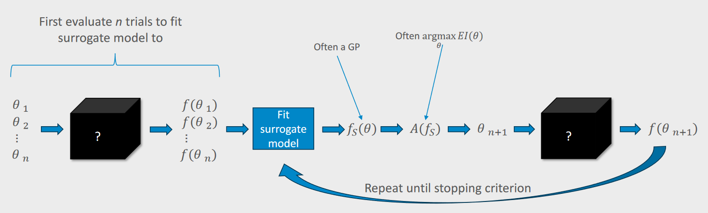

# 10. Miary jakości modeli predykcyjnych. Techniki dostrajania i wyboru modelu.

## Modele predykcyjne

Można je podzielić w zależności od tego co chcemy zrobić
- Modele klasyfikacyjne, czyli chcemy przyporządkować dane pod konkretną etykietę.
- Modele regresyjne czyli chcemy przewidzieć wartość ciągłą 
- Modele klasteryzujące dane 
- Modele wykrywania anomalii  

## Miary jakości 

- **Accuracy** - Jest to najprostsza miara która podaje ile przypadków zostało poprawnie rozpoznanych. Nie radzi sobie z przypadkami danych niezbalansowanych gdzie liczba jednego rodzaju przypadków często jest o wiele niższa niż druga.

$$
ACC = \frac{(TP+TN)}{(FN+TP+TN+FP)}
$$

- **Precision** mierzy odsetek prawdziwie pozytywnych przewidywań wśród wszystkich pozytywnych przewidywań dokonanych przez model. 

$$
Precision = \frac{TP}{TP+FP}
$$

- **Recall** znany również jako **TPR** bądź **sensitivity**
mierzy **%** prawdziwie pozytywnych przewidywań wśród wszystkich rzeczywistych pozytywnych instancji.

$$
Recall = \frac{TP}{TP + FN}
$$

- **specificity** odwrotność sensitivity mierzymy **%** prawdziwych negatywnych przewidywań spośród wszystkich negatywnych instancji.

$$
Specificity = \frac{TN}{TN + FP}
$$

- **F1 score**
łączy precyzję (precision) i czułość (recall) w
jedną metrykę.

$$ F1 = 2 * (\frac{precision * recall}{precision + recall})$$

- **Błąd średniokwadratowy (MSE) i błąd bezwzględny (MAE)** - używane są głównie w problemach regresji aby ocenić odległość przewidywań od rzeczywistych wartości. 

- **Macierz pomyłek:** pokazuje rozkład przewidywań do prawdziwych wartości. Na ich podstawie można wyliczyć powyższe miary.

- Krzywe ROC i AUC/ROC - Krzywe ROC mają pokazać relację pomiędzy TPR i TNR na różnych progach decyzyjnych a AUC (pole pod wykresem) ma pokazać zdolność modelu do poprawnego podejmowania decyzji 

(Odrobinę naciągane ale IMO też może być)

- Wykres straty (Loss)

## Techniki dostrajania modelu

### Model free
- **Grid search**: przeszukujemy dla podanej listy parametrów wybranej przez użytkownika każdą jej kombinację. 

- **Random search**: Zamiast użytkownika program wybiera pseudolosowo kombinacje parametrów i je testuje.

### Model based 

**Optymizacja Bayessowska**

Wykorzystanie modelu zastępczego do znalezienia optymalnych hiperparametrów z pomocą funkcji akwizycji, która wybiera kolejne parametry do oceny.

- Model zastępczy (Surrogate Model):
    - Proces Gaussowski (GP), 
    - Random Forest,
    - Sieć neuronowa Bayesowska (BNN)
- Funkcja akwizycji (Acquisition Function):
   -  Expected Improvement - EI: Liczymy całkę która na podstawie gęstości prawdopodobieństwa ma nam obliczyć spodziewaną wartość poprawy, 
   - Probability of Improvement - PI,
        - Maksymalizuje prawdopodobieństwo, że nowe próby poprawią najlepszy dotychczasowy wynik.
        - Wybiera punkty, w których przewidywane prawdopodobieństwo poprawy jest największe.
        - może prowadzić do eksplorowania lokalnych optymalizacji, zamiast całej przestrzeni.
   - Upper Confidence Bound - UCB.
        - balansuje eksplorację (szukanie nowych obszarów) i eksploatację (wykorzystywanie znanych dobrych punktów).
        - wybiera punkty na podstawie sumy średniej przewidywanej wartości i terminu związanego z niepewnością.
        - Działa dobrze, gdy chcemy równocześnie badać nowe obszary i udoskonalać dotychczas najlepsze wyniki.
   
3. Proces optymalizacji:

- Początkowe oceny prób nn w celu dopasowania modelu zastępczego.
- Iteracyjne wybieranie kolejnych hiperparametrów za pomocą funkcji akwizycji.
- Powtarzanie procesu aż do spełnienia kryterium zatrzymania.

### Hybrid
- jest to po prostu połączenie metod model free i Model based

## Proces wyboru modelu

1. Zrozumienie danych i problemu
2. Ocena ważności cech (za pomocą różnych miar statystycznych, chociażby takich jak korelacja chi-kwadrat)
3. Rozpatrzeć modele i ich złożoności do problemu
4. Ocena skuteczności modelu (Miary F1, Accuracy itd)
5. Walidacja krzyżowa
