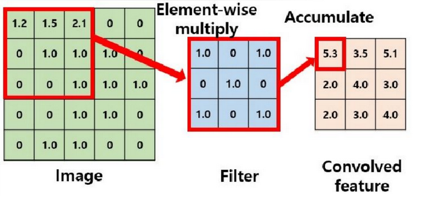
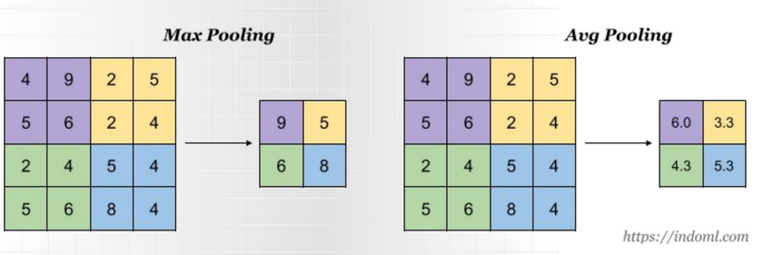
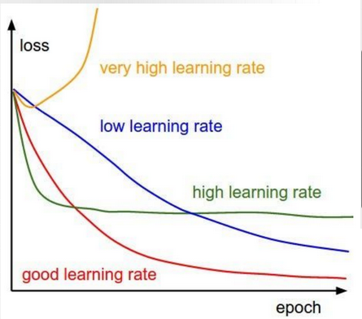

# 11  Wykorzystanie głębokich sieci neuronowych do zadania klasyfikacji obrazów.

W przypadku rozpoznawania obrazów mamy do czynienia z danymi wielowymiarowymi (Wysokość x szerokość x kanały kolorów). Jednym z problemów przy klasyfikacji obrazów z początku było przeniesienie obrazów na jeden wymiar do postaci wektora cech. 

Jako rozwiązanie które jest wykorzystywane do dzisiaj powstały głębokie sieci neuronowe a później konwolucyjne sieci neuronowe.

## CNN

Konwolucyjne sieci neuronowe wykorzystują przemnażanie fragmentów obrazów przez maskę (tzw Kernel), jego zastosowaniem jest wyciąganie wzorców z obrazów oraz poprawiania jakości obrazu.

- Padding - zezwala na nałożenie dodatkowych ramek wokół obrazu które są wypełniane wartością 0. Zezwala to na wydobycie dodatkowych cech z krawędzi obrazka niskim kosztem.
- Stride - jest to parametr określający o ile pixeli przesuwamy nasz kernel. Domyślnie przesuwa się o jeden.    

### Pooling
Operacja mająca na celu zredukować wymiarowość danych przy zachowaniu ważności danych.
Główne cechy:
- sieć jest mniej wrażliwa na przesunięcia w danych wejściowych
- redukcja wymiarowości
#### Average pooling

Oblicza wartość średnią z określonego obszaru danych wejściowych.
Na przykład, w obszarze 2x2, average pooling będzie średnią z czterech wartości.

#### Max pooling
Max pooling polega na wybraniu maksymalnej wartości z określonego obszaru danych wejściowych. Na przykład, w obszarze 2x2, max pooling wybiera największą wartość z tych czterech.

### Flatten:

- Przekształcanie Map Cech na Wektor: flatten służy do przekształcenia wielowymiarowych map cech (wynikających z warstw konwolucyjnych i poolingowych) na jednowymiarowy wektor. Jest to kluczowe, ponieważ warstwy w pełni połączone (fully connected layers), które zwykle następują po warstwach konwolucyjnych, wymagają danych wejściowych w formie jednowymiarowej.

- Przygotowanie do Klasyfikacji: Po przetworzeniu obrazu przez warstwy konwolucyjne i poolingowe, flatten umożliwia przekształcenie wynikającej z tego mapy cech na format, który może być użyty do klasyfikacji (np. rozpoznawanie obiektów na obrazie).

- Alternatywą dla funkcji Flatten jest AverageGlobalPooling

## Techniki poprawiające uczenie się sieci
### Augumentacja obrazów
Aby sprawić aby obraz uczył się generalnych cech a nie zapamiętywał obrazy wykorzystuje się różne techniki augumentacji obrazów takie jak dodawanie drobnego szumu do obrazów, czy też różnego rodzaje transformacje na obrazie jak obroty, wyblurowanie obrazu.

### Normalizacja danych wejściowych
Ma na celu sprawić aby model się nie przeuczał danej grupy pixeli która osiąga o wiele większe wartości niż reszta.

### DropOut
Polega na losowym ustawianiu wag dla ukrytych warstw neuronów na 0 przy każdym etapie treningu. Dzięki tej technice sieć neuronowa trudniej się przeucza, gdyż architektura się przy każdej iteracji treningowej odrobinę się zmienia poprzez zerowanie losowych połączeń neuronów.

## Ewaluacja modelu
Do ewaluacji trenowania sieci oraz aby wiedzieć kiedy zaprzestać treningu wykorzystuje się chociażby funkcję straty i miarę accuracy. Patrząc jak co epokę zmieniają się wartości funkcji straty jak i zmiany wartości Accuracy jesteśmy w stanie określić czy nasz model uczy się czy też się przeucza.  

### Early stopping
Polega na monitorowaniu wydajności modelu na zbiorze walidacyjnym podczas treningu i zatrzymaniu procesu uczenia, gdy wydajność na zbiorze walidacyjnym zaczyna się pogarszać, co wskazuje na rozpoczęcie procesu przeuczenia. Model o najlepszej wydajności na zbiorze walidacyjnym jest zapamiętywany

### Batch normalization

jest to również normalizacja danych wejściowych ale normalizujemy dane tylko dla danego zestawu wejściowego (czyli mając zbiór danych np 10k obrazków i bierzemy batche o wielkości 50 to normalizujemy tylko na podstawie obrazków w batchu). 

## Metryki 

- Warto wspomnieć o F1 score, Macierzy pomyłek. 
