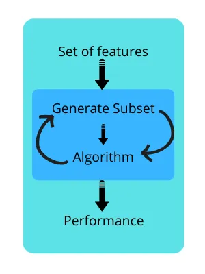
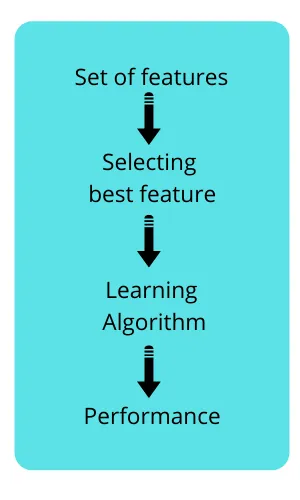

# 12. Metody redukcji wymiarowości

## Dlaczego to robimy

### Curse of dimensionality

Zwiększająca się liczba wymiarów danych powoduje wzrost złożoności obliczeniowej oraz trudności w analizie danych. Wysoka liczba wymiarów może prowadzić do rzadkości danych, gdzie obserwacje stają się rozrzedzone i trudne do modelowania.

### Hughes Phenomenon

Zjawisko to polega na tym, że wraz ze wzrostem liczby cech, początkowo poprawia się wydajność modelu, ale po osiągnięciu pewnego punktu, dalsze dodawanie cech powoduje spadek wydajności. Dzieje się tak, ponieważ większa liczba cech wymaga większej liczby danych do poprawnego trenowania modelu.

## Jak redukować wymiary

### Selekcja cech
#### Uczenie modelu w różnych kombinacjach cech

- **Forward selection:** Dodawanie cech pojedynczo i sprawdzanie, która kombinacja cech poprawia wydajność modelu.
- **Exhaustive selection:** Rozpatrujemy każdą kombinację cech poszukiwaniu tej najbardziej korzystnej.

#### Filtrowanie cech

Filtrowanie cech polega na ocenie i wyborze najbardziej istotnych cech na podstawie statystyk i miar. Metody filtrowania cech zazwyczaj nie wymagają uczenia modelu i są szybkie do zastosowania. Do najczęściej stosowanych technik należą:
- **Współczynnik korelacji**: Mierzy zależność liniową między cechą a celem. Cechy o wysokiej korelacji z celem są zachowywane.
- **Test chi-kwadrat**: Ocena niezależności między cechą a celem w przypadku cech kategorycznych. Cechy, które są istotnie związane z celem, są zachowywane.
- **ANOVA (Analysis of Variance)**: Używana dla cech numerycznych i kategorycznych celu, ocenia wariancję między grupami cech i celem.

### Ekstrakcja cech
#### PCA
##### Idea algorytmu
- Generujemy na podstawie cech nowy zestaw zmiennych tzw. głównych
składowych. Są to liniowe kombinacje oryginalnych cech.
-  Każda z głównych składowych wyjaśnia w pewnym stopniu zbiór danych. Są posegregowane od najwyższej wyjaśnialności do najniższej.
- Każda z tych składowych nie jest skorelowana ze sobą.

##### Najważniejsze do zapamiętania

- szybko się oblicza - zwykłe mnożenie przez macierz
-  Można łatwo dołożyć nowe dane i zobaczyć jak one się rozłożą w przestrzeni.
-  daje przestrzeń o tej samej wymiarowości
-  Jedyny parametr to tylko transformacja na danych
wejściowych-skalowanie/normalizacja
-  Jest łatwo z niej odtworzyć zbiór danych wejściowy
-  Nie radzi sobie z danymi niesparowanymi liniowo.

#### T-SNE

##### Idea

- Obliczamy miary podobieństwa pomiędzy cechami w oryginalnej przestrzeni i zyskujemy macierz
podobieństw (dla czepialskich używamy **rozkład gaussa** bądź **t-student’a**)
-  Staramy się te wyliczone miary prawdopodobieństwa zoptymalizować poprzez wyliczanie losowych
podobieństw pomiędzy danymi w mniejszej przestrzeni (docelowo 2-D) i potem uzyskaną macierz
staramy się jak najbardziej przyporządkować do pierwszej macierzy podobieństw

##### Do zapamiętania

- jest wolny. (Daj zbiór danych co ma więcej niż 10 k wierszy, to oj poczekasz sobie,
dzień, tydzień, rok)
-  Korzysta tylko z analizy sąsiedztwa, bez patrzenia na strukturę globalną, przez co może pokazać zależność, której tak po prawdzie nie ma
- Nie da się odtworzyć wyników z racji losowości na której bazuje.
- Z tego samego powodu jeżeli chcemy dodać więcej danych, to musimy liczyć od nowa.

#### U-MAP

##### Idea
- Tworzymy graf sąsiedztwa z danych wejściowych za pomocą którego chcemy
zmapować relacje w wysoko wymiarowej przestrzeni w nisko wymiarowej
- Wyliczamy miary podobieństwa uwzględniająca odległość pomiędzy punktami w grafie.
- Wykorzystujemy spadek gradientowy do optymalizacji transformacji danych na
rzutowanie na niższy wymiar

###### Do zapamiętania
- Jest to metoda szybsza niż T-sne (i niewiele wolna od PCA)
- W przeciwieństwie do T-SNE da się odtworzyć dane, oraz dodawać nowe próbki
- Zachowuje generalną strukturę danych (lepiej też wyłapuje relacje pomiędzy danymi niż PCA)

## Porównanie metod PCA, UMAP, T-SNE

|    | PCA  | TSNE  | UMAP |
|----|---|---|---|
|Co wykres przedstawia | Główne składowe które opisują wyjaśnialność zbioru danych. | Punkty na wykresie usytuowane na podstawie policzonych macierzy podobieństw | Punkty usytuowane na bazie grafu podobieństw i miar określonych przez użytkownika.
|Z czym sobie nie radzi | Dane nie są liniowo separowalne | Dane są zbyt liczne | Brak specyficznych dla UMAP’a
| Czy da się dodawać więcej danych bez uczenia od nowa | TAK | NIE | TAK |

## Więcej materiałów

- https://www.youtube.com/@statquest

- https://gayathri-siva.medium.com/dimensionality-reduction-feature-selection-and-feature-extraction-28c732818e96