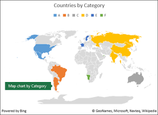

# 13. Techniki prezentacji danych w aplikacjach webowych.

## Tabele

- nie jest potrzebny JS, wystarczy HTML
- mogą być wielodzielne (krzyżowe)
- trudno jest znaleźć powiązania, widzimy jedynie dane w kolumnach i wierszach

## Histogramy, Wykresy pudełkowe

- Wizualizacja zmian jednej zmiennej 
- Obrazuje rozkład zmiennych np średnie, odchylenia standardowe czy też po prostu liczebność każdej wartości
- Wymagają już JS'a do zrobienia wykresu.

## Wykresy prostych 2D 
- rzutowanie 2 współrzędnych, x i y
- techniki pozwalające odkrywać związki między cechami (korelacje)
- najpopularniejszy to wykres punktowy 
- wymagany JS do narysowania
- przykładowe narzędzia: chart.js, plotly.js, Google Charts

## Wykresy 3D 
- Rzutujemy na 3 osiach współrzędnych x, y, z
- Są często nieczytelne chyba że mamy możliwość ich obracania
- Wymagany JS do narysowania i animacji obrotów. 

## Mapy cieplne
- kolor odpowiada wartości cechy w zależności od dwóch współrzędnych
- wykorzystywane przy dużych zbiorach danych (np. w jakich obszarach błędnie interpretuje sieć neuronowa)
- nie jest friendly dla daltonistów (trzeba dostosować gamę kolorów tak aby ludzie z tym schorzeniem byli w stanie odróżnić)

## Mapy 
- niezwykle użyteczne do wizualizacji danych geograficznych, takich jak lokalizacje użytkowników, dane demograficzne, analizy przestrzenne, trasy czy zasięgi.
- Jak zawsze trzeba użyć JS'a bądź API google'a

## Narzędzia wykorzystywane do tego

### Chart.js

### Plotly.js

### Google charts

## Problemy wizualizacji danych

- **Ograniczona pamięć przeglądarki**: Każda maszyna ma ograniczoną pamięć RAM więc jeżeli załądujemy zbyt dużą ilość danych to przeglądarka przestanie działać albo po prostu nie wczyta wykresu.
- **Czas przetwarzania danych**: serwer musi przesłąć dane do użytkownika co w przypadku obszernych zbiorów może trochę zająć. Warto jest wtedy pomyśleć o sposobach cache'owania danych aby przeglądarka nie musiała co chwilę wysyłać zapytań
- **Konieczność wspierania różnych wersji przeglądarek**: Na starszych wersjach przeglądarek część feater'ów możę nie działąć co może spowodować że po prostu część wykresów nie będzie się renderować. 

## Kroki przed wizualizacją 

- zapoznanie się z danymi (jaka jest ich wymiarowość, ile próbek, czego się tyczą itd)
- Czy chcemy zmniejszyć wymiarowość danych by pokazać ich rozkład. 
    - Użyteczne zastosowanie metod redukcji wymiarowości takich jak PCA/T-SNE
- zastanowić się co i jak chcemy użytkownikowi pokazać (Np przy rozkładzie zarobków w kraju lepiej wyglądająca mogłaby być mapa a niżeli na przykład wykres słupkowy)
- Czy dane są dynamicznie (czyli czy będziemy je aktualizować w trakcie interakcji użytkownika)