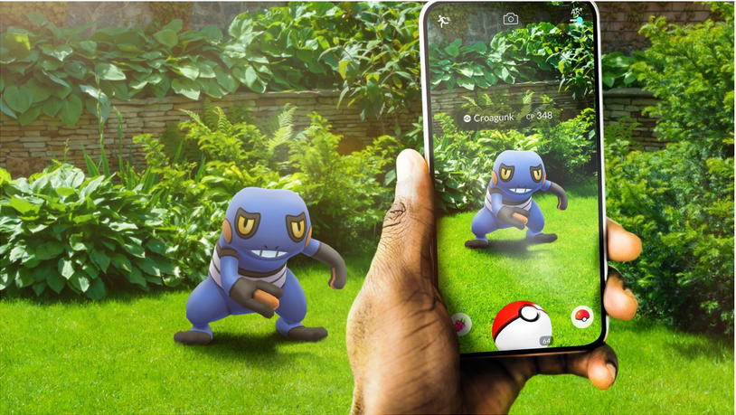
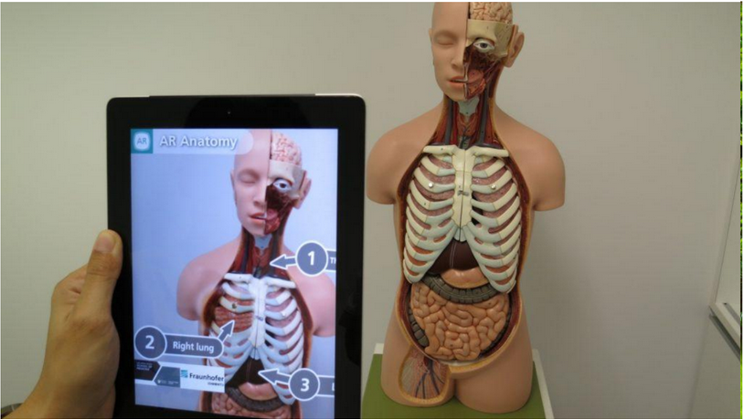
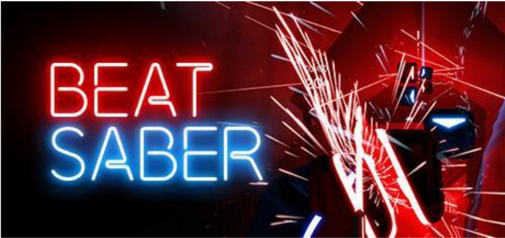
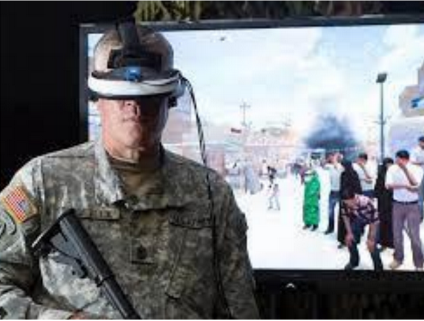
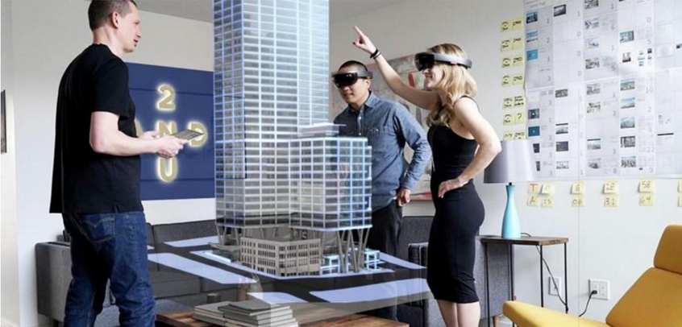

# 14. Definicje, charakterystyka i zastosowania rzeczywistości rozszerzonej i wirtualnej.

## Definicje

### Rzeczywistość wirtualna (VR)
Są to technologie generujące w pełni wirtualny świat, w który możemy się całkowicie zanurzyć. Przebywając w rzeczywistości wirtualnej nie masz kontaktu z realnym otoczeniem.

### Rzeczywistość rozszerzona (AR)
to technologia, która wzbogaca obserwowany
świat rzeczywisty poprzez nakładanie na niego informacji wygenerowanych komputerowo, zazwyczaj z
wykorzystaniem ekranu urządzenia mobilnego: telefonu, tabletu itp. Jest przedstawiane jako **przeciwność** VR. Zamiast użytkownika odciąć od świata rzeczywistego, AR celuje w rozszerzenie świata rzeczywistego o dodatkowe informacje, z którymi nie jest w stanie wchodzić w interakcje.

### Rzeczywistość mieszana (MR)
Najłatwiej jest porównać ją do rzeczywistości rozszerzonej. Podstawową różnicę między nimi
stanowi fakt, że urządzenia mieszanej rzeczywistości cechuje **interaktywność.** Ponadto, MR łączy się ze
światem rzeczywistym, co oznacza, że obiekt cyfrowy może zniknąć za obiektami stałymi lub obiekty
stałe mogą mieć inny wygląd. Ponieważ rzeczywistość mieszaną upraszcza się do terminu rozszerzonej
rzeczywistości (AR).

Firma Microsoft wypuściła własny sprzęt MR – HoloLens. Jest to hełm mieszanej rzeczywistości, który
nakłada na realny obraz hologramy. Urządzenie skanuje otoczenie, w którym znajduje się użytkownik i
dostosowuje do niego zachowanie danej aplikacji.

### Ważne pojęcia w kontekście rozróżniania technologii

- **Immersja** jest to proces „zanurzania” albo „pochłaniania” osoby przez rzeczywistość elektroniczną.
Następuje tak zwane „zanurzenie zmysłów”. Immersja to po prostu fizyczne zanurzenie się człowieka w
świat wirtualny. Im więcej zmysłów angażuje świat wirtualny, tym większej immersji doświadczamy.
W imersję najbardziej się zagłębiamy w rzeczywistości VR potem MR a na sam koniec AR.

- **interaktywność** możliwość wpływania na obiekty w świecie wirtualnym. Najmniejszym stopniem interaktywności cechuje się rzeczywistość AR potem MR i VR.

- **Metaverse** – Wykorzystuje różnego rodzaju technologie, aby stworzyć/uzyskać dostęp do wirtualnych
światów, w których użytkownik może robić niemal wszystko, np. pójść na spacer, posłuchać muzyki,
zagrać w gry wideo, odwiedzić muzea itd. Użytkownicy mogą tworzyć i odkrywać wraz z innymi ludźmi, którzy niekoniecznie znajdują się w tej samej przestrzeni fizycznej. Użytkownicy muszą stworzyć swoje cyfrowe awatary, które człowiek kontroluje podczas interakcji w metaverse. **Oznacza poziom głębokiej interoperacyjności pomiędzy światami i platformami, w których zasoby i postacie przepływają z jednego do drugiego.**

## Przykładowe realizacje technologii

- HMD (Head Mounted Display) [link](https://coolinfographics.com/blog/2014/3/24/how-google-glass-works.html)

- HUD (Head up display) [link](https://www.carwow.co.uk/guides/glossary/what-is-a-head-up-display#gref)

## Zastosowania

### AR
- Rozrywka Pokemon GO

- Edukacja nauka na przykład układu ciała człowieka

### VR
- Rozrywka

- Medycyna, leczenie różnych schorzeń między innymi stresu
pourazowego (PTSD) poprzez nastawianie w układzie kontrolowanym osobę chorą na czynnik stresogenny by pomóc jej zwalczyć stres.

### MR 
Tworzenie hologramów aktywnych za pomocą holo lens. Można stosować w różnych dziedzinach, zarówno w edukacji jak i rozrywce. 

## Konsekwencje z nadmiernego korzystania z technologii

- **Choroba symulatorowa** – najczęściej objawy to: mdłości i wymioty, zawroty głowy, zaburzenia równowagi, dezorientacja, trudności w koncentracji, oszołomienie itp. Powodem takich reakcji jest konflikt tego co myśli mózg z tym co faktycznie dzieje się z ciałem. Mózg takie sprzeczne informacje zaczyna interpretować jako zatrucie i stwierdza, że mamy halucynacje. W rezultacie odczuwamy fałszywe objawy zatrucia a mózg wywołuje odruchy mające na celu oczyszczenie organizmu.