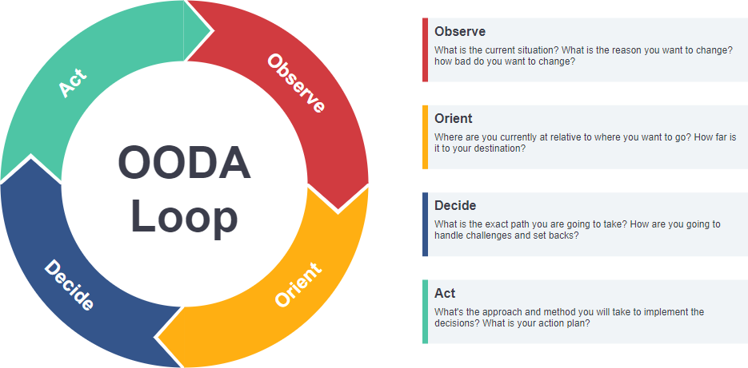
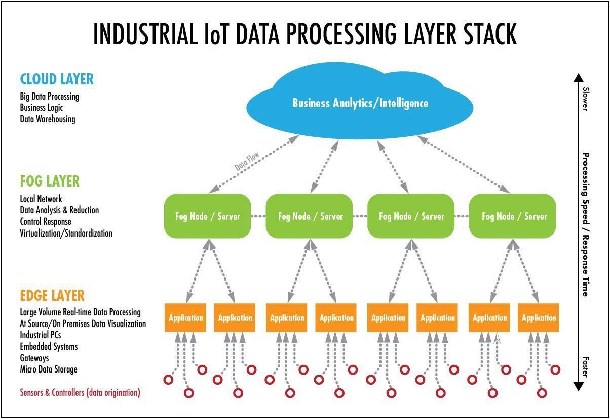
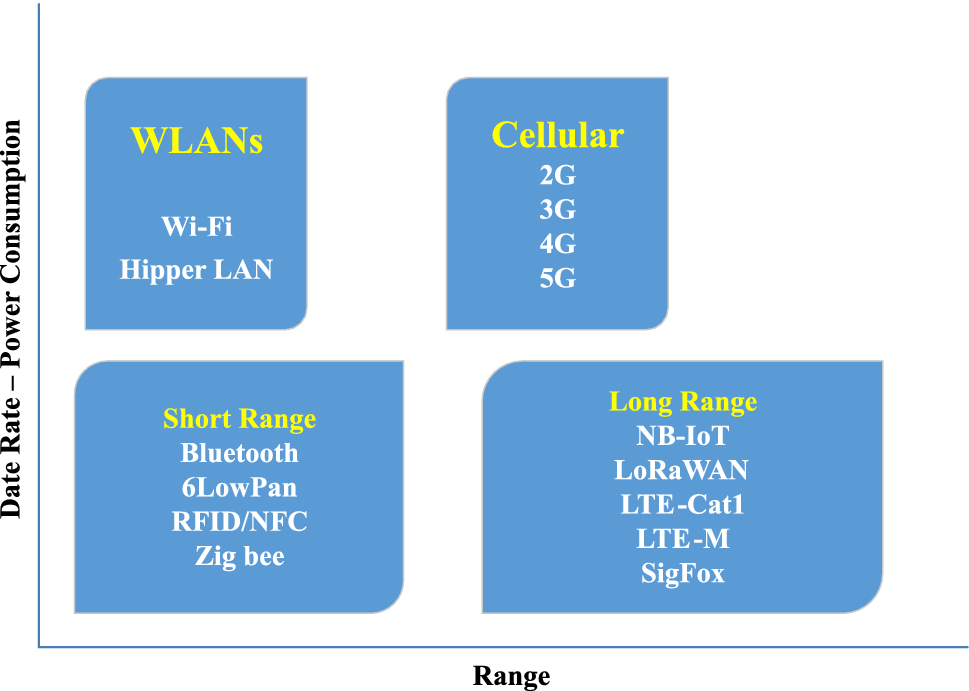
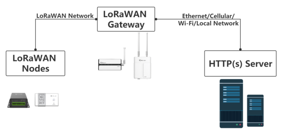

# 17. Przetwarzanie i gromadzenie informacji w systemach rozproszonych, autonomicznych i sieci IoT

## Systemy rozproszone
Systemy rozproszone to zbiór niezależnych urządzeń technicznych połączonych w jedną, logiczną całość. Charakteryzują się:
- **Skalowalnością**: Możliwość dodawania nowych zasobów bez wpływu na wydajność.
- **Odpornością na błędy**: Awaria jednego komponentu nie powinna zatrzymać działania całego systemu.
- **Spójnością danych**: Zachowanie zgodności danych w różnych lokalizacjach.

## Systemy autonomiczne
Systemy autonomiczne to urządzenia, które mogą samodzielnie sterować swoim działaniem i adaptować się do zmieniających się warunków. Są one klasyfikowane w sześciostopniowej skali, gdzie poziom 0 oznacza pełne zależenie od człowieka, a poziom 5 pełną autonomię. Ważnym narzędziem w autonomii jest **OODA Loop** (Observe, Orient, Decide, Act):
- **Observe**: Zbieranie danych z otoczenia.
- **Orient**: Analiza i interpretacja danych.
- **Decide**: Podejmowanie decyzji na podstawie algorytmów i analizy danych.
- **Act**: Wdrażanie decyzji i adaptacja do zmieniających się warunków.

## Internet Rzeczy (IoT)
IoT to sieć urządzeń połączonych przez internet, które mogą zbierać, przetwarzać i wymieniać dane. Kluczowe elementy:
- **Mist**: Sensory i urządzenia końcowe dostarczające dane.
- **Edge**: Przetwarzanie danych bliżej urządzeń końcowych; filtrowanie i przetwarzanie wstępne.
- **Fog**: Warstwa pośrednia z mniejszymi kosztami energetycznymi, wspomagająca Edge.
- **Cloud**: Ostateczne przetwarzanie danych, zaawansowane usługi chmurowe (IaaS, PaaS).

## Sieci IoT
Sieci IoT wykorzystują różne technologie transmisji danych:
- **Wi-Fi**: Wysoka prędkość, niski zasięg, wysoki koszt energetyczny.
- **Bluetooth/BLE**: Niska energia, krótki zasięg.
- **Sieci komórkowe**: Duży zasięg, wysokie zużycie energii.
- **LPWAN**: Niska energia, duży zasięg, niska prędkość przesyłania danych (np. LoRa).

## Przetwarzanie danych
Przetwarzanie dużych ilości danych wymaga efektywnych technologii i architektur. W przypadku systemów IoT częstą decyzją jest korzystanie z aplikacji wstępnie filtrujących dane aby przesyłać dalej już tylko to co jest użyteczne i nie marnować zasobów w późniejszym etapie.

## Projektowanie systemów
Przy projektowaniu systemów należy uwzględnić:
- **Zasięg i przepustowość**: Dobór odpowiedniej technologii transmisji.
- **Koszt energetyczny**: Optymalizacja zużycia energii.
- **Regulacje prawne**: Dostosowanie do lokalnych przepisów dotyczących pasm częstotliwości.

## LoRaWAN:
Jest to warstwa oprogramowania, która zezwala na daleki zasięg w komunikacji i stosunkowo niski pobór mocy. Jest to technologia otwartoźródłowa której klient może postawić całą infrastrukturę, lub korzystać z modelów subksrybcyjnych, gdzie klient jedynie posiada urządzenia końcowe wraz z bramkami.

- **Urządzenia końcowe** – zezwalają na monitoring,katalogowanie i optymalizację uzyskiwanych informacji.
- **Bramki** – Urządzenia odpowiadające za komunikację z urządzeniami końcowymi. One propagują sygnał LoRaWAN. W zależności od konfiguracji pojedyncza bramka jest w stanie połączyć z dużą liczbą urządzeń

- **Network Serwer** – Serwer zapewnia sterowanie ruchem łącza od strony bramek jak i też zapewnia interfejs łącza do aplikacji, dzięki czemu użytkownicy mogą mieć podgląd w dane i podejmować decyzje. Przykładem takiego rozwiązania jest **The things network**

- **Aplikacja** – aplikacje pozwalają uporządkować w jednym miejscu wszystkie urządzenia IoT, które posiada użytkownik. Zezwalają również na ustawienie inteligentnych alarmów bądź monitoringu danych w zależności od konkretnego kryterium. Do tego celu często używa się baz danych nierelacyjnych (np **InfluxDB**) oraz aplikacji wizualizujących dane (np **Grafana**)

