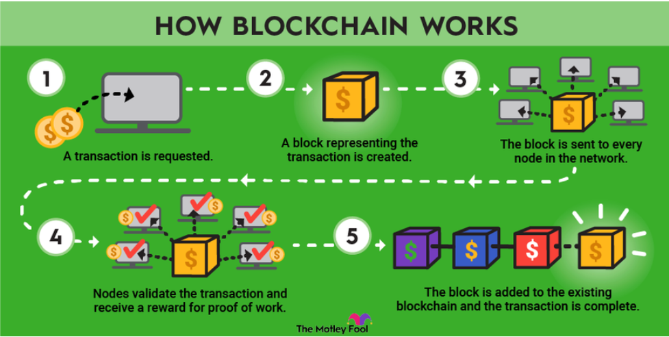

# Wykorzystanie łańcucha bloków do zapewnienia niezmienności rejestrów danych

## Czym do cholery jest block-chain?

Jest to technologia, która służy do przesyłania i przechowywania informacji o transakcjach internetowych. Informacje zostają ułożone w postaci następujących po sobie bloków danych. Jeden blok zawiera informacje o określonej liczbie transakcji, następnie po jego nasyceniu tworzy się kolejny blok danych.

## Proces działania.

W skrócie:
- użytkownik tworzy blok reprezentujący transakcję (podpisuje go podpisem cyfrowym)
- blok jest wysłany do każdego węzła w sieci
- Każdy z węzłów sprawdza czy blok jest prawidłowy, następnie go akceptują bądź odrzucają na podstawie **Proof of work** / **Proof of Concept** 
- Blok jest dodawany do istniejącego blockchain'a. 

Z czego się składa pojedynczy blok:
- Znacznik czasu
- dane transakcji
- kryptograficzny skrót (hash) poprzedniego bloku. W ten sposób mamy odniesienie do poprzedniego elementu w liście i tworzymy listę jednokierunkową.

## Cechy blockchainu

**Decentralizacja** - Blockchain jest przechowywany w rozproszonym systemie **peer-to-peer** (p2p), co oznacza, że wiele kopii łańcucha bloków jest przechowywanych na różnych węzłach w sieci. Są one wykorzystywane do
udostępniania, rejestrowania i zatwierdzania transakcji. 

**Niezaprzeczalność** transakcji: każda transakcja zatwierdzana przez nadawce, co zapewnia że źródło jest autentyczne i w późniejszym rozrachunku wręcz niemożliwe do podmienienia. 

**Niezmienność** transakcji: Raz zatwierdzona transakcja przez wszystkie node'y już nie może zostać nadpisana bądź zarejestrowana ponownie
