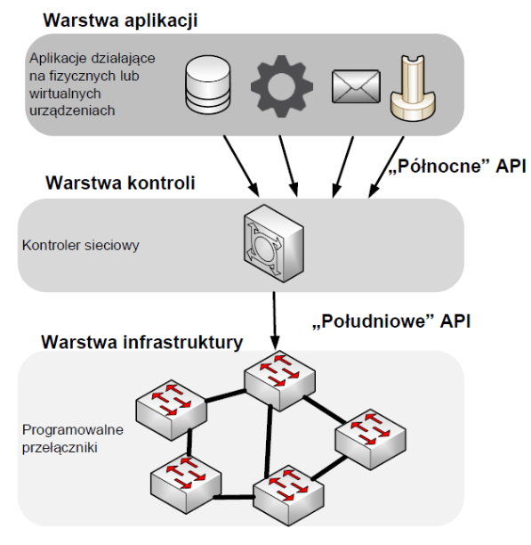
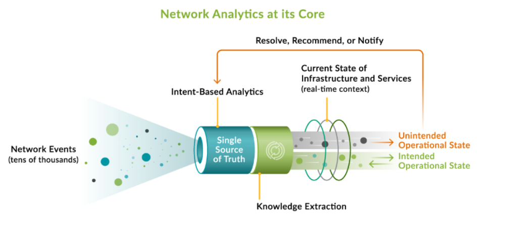

# 4.  Koncepcja sieci sterowanych programowo (SDN)

**Software-Defined Networking (SDN)**, czyli koncepcja sieci sterowanych programowo to
nowy paradygmat zarządzania siecią. Jego głównym celem jest
umożliwienie elastycznego i programowalnego sterowania infrastrukturą sieciową, co
ma na celu usprawnienie zarządzania zasobami oraz umożliwienie innowacyjnych
rozwiązań i eksperymentów także w dziedzinie automatyzacji sieci komputerowych.

POwody powstania SDN:

- Zmiana charakterystyki ruchu w sieciach
- Wzrost popularności rozwiązań cloud computing i rozwój centrów danych
- Przetwarzanie Big Data

## Decoupling

Podstawowa idea SDN która polega na odseparowaniu warstwy kontrolującej
od warstwy przesyłowej. Jest ona skonfigurowana w logicznie
scentralizowanym kontrolerze, który komunikuje się z urządzeniami przesyłowymi (np.
przełącznikami) poprzez zdefiniowany interfejs, jak chociażby protokół **Openflow**.

## Warstwy SDN

- **Aplikacje sieciowe (Application Plane)** – odseparowana płaszczyzna, która
korzystając z danych umożliwia osiągnięcie określonych celów, takich jak:
mechanizmy bezpieczeństwa czy monitorowanie sieci. Aplikacje komunikują się z
kontrolerem poprzez interfejs północny warstwy kontrolera.
-  **Kontroler SDN (Control Plane)** – płaszczyzna, która bezpośrednio manipuluje
urządzeniami przesyłowymi w celu spełnienia określonych celów zadanych przez
aplikacje. Używa interfejsu południowego do połączenia z płaszczyzną danych.
-  **Warstwa infrastruktury (Data Plane)** – część, która obsługuje wspólny protokół (np.
OpenFlow) z kontrolerem i przetwarza rzeczywiste żądania i pakiety na podstawie
konfiguracji przygotowanej przez kontrole

## Modele SDN

- **Open SDN** – wykorzystanie OpenFlow do kontrolowania zachowania fizycznych i
wirtualnych przełączników.
- **SDN by APIs** – sterowanie przepływem w sieci przez interfejsy API poszczególnych
urządzeń.
- **Overlay SDN Model** – tworzenie wirtualnej sieci na istniejącej infrastrukturze
sprzętowej; urządzenia końcowe przypisywane do dynamicznych tuneli, którym
indywidualnie przydzielana jest przepustowość; sieć fizyczna pozostaje nietkniętą.
- **Hybrid SDN** – model współistniejący z innymi protokołami

### Openflow

Jest to protokół realizujący ideę SDN w **odseparowaniu warsty kontrolnej od przesyłowej** poprzez definiowanie interfejsu komunikacyjnego pomiędzy kontrolerem a przełącznikami, co zezwala na **zdalną** konfigurację sieci.

Standard ten zezwala na **globalne podejmowanie decyzji** wobec przekazywania ruchu sieciowego z pojedynczych urządzeń do kontrolera SDN. 

Standard ten zezwala również na **programowanie reguł przekazywania pakietów w przełącznikach**, co zezwala na szybkie i zdalne dostosowanie się do wymagań sieci. Możliwość programowania tych reguł zezwala na ułatwione badania i eksperymentowanie nad nowymi protokołami czy też usługami sieciowymi.

Kontroler SDN może optymalizować przekazywanie pakietów dzięki globalnemu dostępowi jak i dostosowywać się do zmiennych warunków

Protokół OpenFlow zapewnia sterownikowi SDN trzy typy informacji:
- **Wiadomości oparte na zdarzeniach:** wysyłane przez przełącznik do kontrolera w
przypadku zmiany łącza lub portu.
- **Statystyki przepływu:** generowane przez przełącznik na podstawie przepływu ruchu.
- **Obudowane Pakiety:** wysyłane przez przełącznik do kontrolera, ponieważ istnieje
jawna akcja wysłania tego pakietu we wpisie tablicy przepływu lub ponieważ
przełącznik potrzebuje informacji do ustanowienia nowego przepływu.

### Intent Based Network

Jej głównym celem jest zmierzać ku bardziej intuicyjnemu i
zautomatyzowanemu zarządzaniu sieciami poprzez **interpretację intencji użytkownika**. W
tym kontekście, administratorzy sieci definiują **pożądane cele i wymagania**, a system
automatycznie przekłada je na konkretne **akcje konfiguracyjne**. Dzięki IBN, eliminuje się
konieczność bezpośredniej interakcji z infrastrukturą sieciową na poziomie technicznym, co
przyspiesza procesy oraz redukuje ryzyko błędów ludzkich.

Koncepcje dobrze pokazuje poniższa grafika

### Warte wspomnienia

