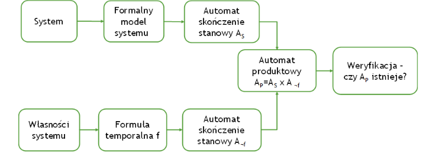

# 8. Weryfikacja modelowa z zastosowaniem logiki temporalnej

Inspiracja (A wręcz kopiuj wklej pewnie z [stąd](https://github.com/jakub-batogowski/pwr-ma-thesis-questions/blob/master/K_08/K8%20-%20opracowanie.pdf))

## Logika temporalna

- pozwala wnioskować z uwzględnieniem czasu (wnioskowanie w dziedzinie czasu),
- przypisuje wartość prawda / fałsz do wyrażeń logiki modalnej,
- umieszcza wartość prawda / fałsz w strukturze czasowej.

## Rodzaje logiki temporalnej

- LTL (Linear Temporal Logic)
    - czas: dyskretny, lewostronnie skończony, liniowy, punktowy;
- CTL (Computation Tree Logic)
    - czas: dyskretny, lewostronnie skończony, rozgałęziony (lewostronnie liniowy), punktowy;
- RTCTL (Real-Time Computation Tree Logic)
    - wersja CTL, gdzie wartości czasu dane są ilościowo jako stałe;
- PRTCTL (Parametrised Real-Time Computation Tree Logic)
    - wersja CTL, gdzie wartości czasu dane są ilościowo jako zmienne.
- ITL (Interval Temporal Logic)
    - czas: dyskretny, skończony lub nieskończony, liniowy, przedziałowy;

## Podstawowe operacje w logice temporalnej

|Podstawowe operatory | Operatory ścieżkowe dostępne w CTL
|---|---|
| U "dopóki"| A - dla kazdej możliwej ścieżki
| X "Następnie"| E - dla pewnej możliwej ścieżki
| G "Zawsze"|
| F "Kiedyś"|

## Weryfikacja modelowa

Automatyczna i wyczerpująca weryfikacja danego modelu systemu pod kątem spełnienia przez niego zadanych specyfikacji. Jest to metoda automatycznego sprawdzania poprawności właściwości automatów skończonych. Zawiera wytyczne dotyczące bezpieczeństwa i osiągalności. Jest to formalna technika weryfikacji skończonych systemów współbieżnych, automatów skończenie stanowych. Składa się z trzech podstawowych kroków: modelowania, specyfikacji i weryfikacji.

### Co to jest skończony system współbieżny?
To program składający się z procesów, które:
- Są wykonywane w tym samym czasie
- Mogą współdzielić pewne zasoby, np. zmienne
- Mogą wzajemnie na siebie oddziaływać na siebie
### Co to jest automat skończenie stanowy?
To abstrakcyjna maszyna stanowa, która:
- składa się ze skończonej liczby stanów i przejść między nimi
- ma stany początkowe i może mieć stany końcowe
- jest automatem, w którym przejścia między stanami są jednoznacznie opisane funkcją przejścia

### Weryfikowane własności modelu:
1. Osiągalność - czy "pożądany" stan p w końcu zostanie osiągnięty
LTL: Fp
CTL: EFp
2. Bezpieczeństwo- czy "niechciany" stan q systemu nigdy nie zostanie osiągnięty
LTL: G ¬q
CTL: AG ¬q
3. Odpowiedź – czy p jest spełnione od czasu do czasu
LTL: GFp
CTL: EGFp
4. Trwałość – od pewnego momentu p jest zawsze spełnione
LTL: FGp
CTL:EFGp
5. Żywotność – q jest osiągalne jakoś skutek p
LTL: G(p => Fq)
CTL: EG(p => Fq)

### Algorytm modelowej weryfikacji systemu

1. Zbuduj skończenie stanowy automat $A_S$ dla modelu systemu S
2. Zapisz własności systemu jako formułę f
3. Zbuduj skończenie stanowy automat $A_{¬f}$ dla formuły ¬f
4. Zbuduj automat produktowy dla $A_P = A_S x A_{¬f}$
5. Zweryfikuj, czy istnieje $A_P$

### Zalety
- W pełni automatyczna
- Kontrprzykład, gdy uzyskujemy negatywną odpowiedź
### Ograniczenia
- Złożoność obliczeniowa – eksplozja stanów
- Weryfikacja modelu a nie samego systemu
- Błędy w narzędziach. (Zarówno NuSMV jak i UPAAL są narzędziami z wieloma bugami)