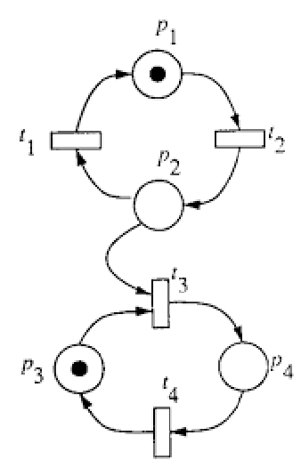

# 9. Analiza systemów informatycznych z użyciem sieci Petriego

## Definicja

Sieć Petriego to graficzna reprezentacja analizowanego systemu (graf ważony skierowany)

## Konstrukcja sieci Petriego

- **Miejsce** (okrąg): trzyma znaczniki. Ma określoną ich pojemność
- **łuki** (strzałki): zezwalają na przemieszczanie znaczników. Każdy łuk może mieć swoją wagę, która potem służy jako warunek aby móc odpalić konkretne przejście.
- **Przejście** (prostokąt): Aby móc je odpalić, połączone z nim miejsca
muszą mieć wymaganą przez łuki transportowe liczbę znaczników

Przykładowo na poniższym rysunku jeżeli chcemy odpalić przejście $t_1$, to musimy wpierw odpalić przejście $t_2$ aby przekazać znacznik z miejsca $p_1$ do miejsca $p_2$

## Zastosowania sieci Petriego
- informatyka: modelowanie procesów współbieżnych np problemu jedzących filozofów, producent konsument itd.
- Automatyka
- Bioinformatyka
- Analiza danych
- Organizacja pracy

## Typy stanów sieci Petriego
- **Stan początkowy** – początkowy stan rozproszenia żetonów
- **Stan osiągalny** – stan osiągalny ze stanu początkowego
- **Stan martwy** – stan, w którym nie ma aktywnych przejść
- **Stan końcowy** – stan w którym jest brak aktywnych przejść
- **Stan bezpieczny** – stan osiągalny ze wszystkich innych stanów

## Własności behawioralne sieci Petriego

- **Bezpieczeństwo** – w dowolnym znakowaniu osiągalnym miejsca sieci bezpieczniej, mogą
zawierać co najwyżej jeden znacznik

- **Ograniczoność** – w dowolnym znakowaniu osiągalnym miejsca sieci ograniczonej mogą
zawierać co najwyżej skończoną liczbę znaczników

- **Osiągalność** – czy oczekiwany stan końcowy jest osiągalny z danego stanu początkowego

- **Zachowawczość** – sieć jest zachowawcza, jeśli podczas wykonywania znaczniki mogą
rozszczepiać się i łączyć ponownie, powracając do tej samej liczby

- **Żywotność** - przejście t jest uznawane za żywe kiedy dla każdego znakowania osiągalnego
można wyznaczyć ciąg przejść zawierający t

- **Zakleszczenie** – brak możliwość odpalenia jakiejkolwiek tranzycji

- **Odwracalność** - system jest odwracalny, jeśli istnieje możliwość powrotu do staniu
początkowego po wejściu w stan błędu