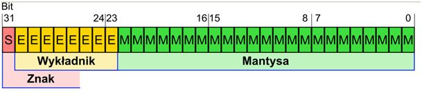

# 2. Arytmetyka stało- i zmiennoprzecinkowa.

[Autor odpowiedzi](https://github.com/qucker135)

## Przykłady systemów stałoprzecinkowych.

### System naturalny

W systemie tym wartość kodowana przez reprezentację jest obliczana jako suma po wszystkich pozycjach iloczynów cyfry znajdującej się na danej pozycji oraz wagi charakterystycznej dla tejże pozycji. Dla systemu naturalnego wartości mogą być nieujemne ($<0; 2^n-1>$).

### System znak moduł
Względem systemu naturalnego pojawia się dodatkowy opcjonalny symbol (w rachunkach najczęściej oznaczany jako minus na początku reprezentacji), wskazujący na fakt, że mamy do czynienia z reprezentacją kodującą ujemną wartość. Dla podstawy $β = 2$ n-elementowa reprezentacja koduje
wartości z przedziału $< −2n−1 + 1; 2n−1 −1 > $; dwie reprezentacje kodują wartość zera - przykład kodu redundantnego.

### System uzupełnieniowy pełny

Różni się od systemu naturalnego sposobem interpretacji cyfry na najstarszej pozycji - jeśli wartość
tejże jest mniejsza od połowy bazy, jest ona pozostawiana bez zmian; w przeciwnym wypadku do
iloczynu cząstkowego dla danej pozycji brana jest wartość cyfry pomniejszona o wartość podstawy
(wzór $ X = (x_n - \theta(X) * \beta)*\beta^n + \sum^{n-1}_{i=-m} x_i * \beta^i $). Dla podstawy β = 2 n-elementowa reprezentacja koduje wartości z przedziału $< −2n−1; 2n−1 − 1 >$ ; W systemie tym cyfra rozszerzenia nieskończonego lewostronnego jest równa $0$ lub $β − 1$, w zależności od tego, czy kodowana wartość jest ujemna czy też nie.

## Arytmetyka zmiennoprzecinkowa

### Podstawa matematyczna

Wartość liczby obliczana jest ze wzoru na notację naukową: $X = S ∗ M ∗ β^W$ , gdzie: S - znak,
czynnik równy 1 lub -1; M - bity ułamkowe mantysy; W - wykładnik; przy czym wartość wykładnika dobrana jest
tak, by była całkowita, a mnożnik należał do przedziału $< 1; β$).

### Standard IEEE 754

Standard reprezentacji binarnej i operacji na liczbach zmiennoprzecinkowych, implementowany powszechnie w procesorach i oprogramowaniu obliczeniowym. Określa podział słowa kodowego na trzy
pola bitowe: 
- jeden bit znaku (0 - znak dodatni; 1 - znak ujemny)
- wykładnik zakodowany w (zmodyfikowanym, patrz: wartości specjalne) kodzie z przesunięciem, 
- część ułamkową mnożnika.

W ramach standardu mieszczą się także elementy wspomagające sprzętową realizację arytmetyki zmiennoprzecinkowej, tj. wartości specjalne, wyjątki oraz tryby zaokrąglania.

### Wartości specjalne 

- NaN - reprezentacje zwracane w momencie wykonania operacji dla nieprawidłowych argumentów, np. pierwiastek kwadratowy z liczby ujemnej.

- $\pm 0$ - dwie reprezentacje, w których bit znaku jest dowolny, a pozostałe mają wartość 0
kodują wartość 0. W większości języków programowania operator porównywania jest tak
przeciążony dla typów zmiennoprzecinkowych, by zwracał true dla porównywania 0 == −0.

- $\pm \infin $ - reprezentacje zwracane w sytuacjach, gdy dokładny wynik jest zbytnio oddalony od zera, by móc go zakodować w danym formacie. Jest także zwracany w wyniku dzielenia przez zero.

- r. nieznormalizowane - reprezentacje, dla których wykładnik jest reprezentowany przez same jedynki; umownie wartość całkowita mnożnika ma dla nich wartość 0 - to oznacza, że najstarsza cyfra znacząca występuje na którymś z bitów części ułamkowej mnożnika, a zatem dochodzi do pogorszenia się dokładności względnej wyniku.

### Wyjątki FPU

- Overflow - wynik działania nie mieści się w zakresie dopuszczalnym ze względu na maksymalne wartości wykładnika i mnożnika - w wyniku działania zwracana jest wartość $\pm \infin $

- Underflow - wynik działania jest zbyt bliski zera, by móc być prezentowany z pełną dokładnością względną - zwracana jest reprezentacja nieznormalizowana lub $\pm 0$

- Inexact - wynik nie może być reprzezentowany w sposób dokładny (np. $1/3$ ) i musi zostać
zaokrąglony. Sposób zaokrąglania określają **tryby zaokrąglania**.

- Invalid operation - wykonano operację, która dla danego argumentu nie jest możliwa bądź wynik jest pozbawiony sensu (np. pierwiastek z liczby ujemnej). Jako wynik zwracany jest Nan.

- Division by zero - doszło do dzielenia, w którym dzielnik był równy $\pm 0$. Jako wynik zwracana jest $\pm \infin $.

### Tryby zaokrąglenia 

- **To nearest, ties to even** - zaokrągla wynik do reprezentacji z parzystą najmłodszą cyfrą.
- **To nearest, away from zero** - zaokrągla wynik do reprezentacji położonej dalej od zera.
- **Toward** 0 - zaokrągla w kierunku zera.
- **Toward** $+ \infin$ - zaokrągla zawsze w górę.
- **Toward** $- \infin$ - zaokrągla zawsze w dół.

## Streszczenie 

- Przykłady arytmetyki stałoprzecinkowej
- Arytmetyka zmiennoprzecinkowa
- wyjątki FPU
- Tryby zaokrąglenia 
