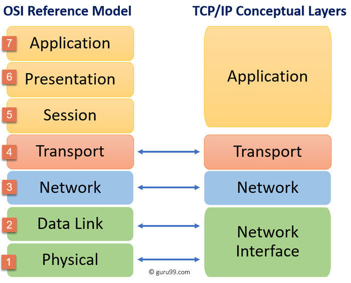

# 4. Model warstwowy TCP IP 

## Co to TCP/IP

Model TCP/IP to warstwowy model struktury protokołów komunikacyjnych w sieciach komputerowych, opracowany razem z odpowiadającym mu zestawem protokołów w latach 70. w agencji DARPA (Stany Zjednoczone); sam model jak i zestaw protokołów TCP/IP został zaprojektowany w otwartej architekturze i nie jest
ograniczony żadnymi patentami ani prawami autorskimi.

## W modelu TCP/IP wyróżnia się 4 warstwy:

    
- warstwa aplikacji – udostępnia użytkownikom możliwość korzystania z usług sieciowych, takich jak WWW, poczta elektroniczna, wymiana plików, połączenia terminalowe czy komunikatory. Przykładowe protokoły: 
    - HTTP (strony WWW), 
    - DNS (tłumaczenie nazw domenowych), 
    - SMTP (wymiana poczty), 
    - SSH (zdalna praca konsolowa),

- warstwa transportowa – warstwa zapewniająca kanał komunikacyjny między poszczególnymi aplikacjami na komunikujących się ze sobą urządzeniach, dzieląca dane na segemnty po stronie nadawczej i składająca po stronie odbiorczej, kierująca do każdej z aplikacji ruch sieciowy na podstawie przypisanego jej numeru portu, na jej poziomie wykorzystuje się 2 protokoły:
    - TCP (połączeniowy, gwarantujący niezawodność transmisji)
    
    - UDP (bezpołączeniowy, szybszy, ale nie gwarantujący poprawności transmisji),

- warstwa internetowa (warstwa internetu) – warstwa odpowiadająca za
wyznaczanie trasy (routing) i przekazywanie pakietów do kolejnych sieci znajdujących się pomiędzy urządzeniem źródłowym i docelowym,
podstawowym protokołem tej warstwy jest protokół IP, wykorzystujący do identyfikacji urządzeń unikalne w skali całej sieci adresy IP,
    
    - IP - wybiera najlepszą drogę transportu pakietów (IPV4 - adresy 32 bitowe IPV6 - adresy 64 bitowe)
    
    - ICMP - używany przez polecenia w konsoli sprawdzające jakość połączenia

- warstwa dostępu do sieci – najniższa warstwa, której zadaniem jest
transmitowanie danych przez fizyczne łącza między urządzeniami w obrębie pojedynczej sieci. 
    - Ethernet / WIFI

    - MAC - adres fizyczny urządzenia

Każda z warstw jest niezależna od pozostałych. Przykładowo, na poziomie warstwy aplikacji po drugiej stronie łącza widoczna jest bezpośrednio aplikacja, z którą
zostało nawiązane połączenie, niezależnie od trasy pokonywanej przez pakiety w warstwie internetowej. Z kolei z perspektywy warstwy internetowej po przeciwnej stronie łącza znajduje się następne urządzenie na trasie posiadające adres IP, niezależnie od fizycznej struktury sieci i przykładowo liczby przełączników, jakie musi pokonać ramka przenosząca pakiet IP. Dzięki temu można łatwo wykorzystać w sieci różne technologie i z punktu widzenia wyższych warstw nie ma na przykład znaczenia, czy fizycznie transmisja odbywa się kablem w standardzie Ethernet, czy bezprzewodowo w jednym ze standardów Wi-Fi – dowolny rodzaj danych da się przesłać dowolnym łączem.

## Porównanie UDP vs TCP

||TCP|UDP|
|:---|:---:|:---:|
Kontrola poprawności transmisji| TAK | NIE|
Duży narzut informacji| TAK | NIE|
Potrzeba zestawiania połączenia| TAK | NIE|
Szybka transmisja| NIE | TAK|
Sterowanie przepływem| TAK | NIE|
Identyfikacja procesów| TAK | NIE |

## TCP/IP a ISO OSI 

## Streszczenie 

- Co to jest TCP/IP
- Wymiana warstw 
- Porównanie UDP i TC
- Porównanie TCP/IP z ISO OSI
