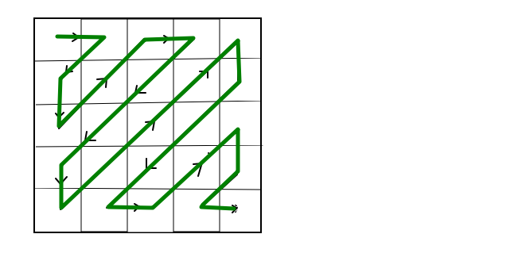

# 6. Standardy kompresji obrazów statycznych i sekwencji obrazów, różnice zalety i wady

## Podstawowe pojęcia

### Kompresja obrazu
- zmniejszenie rozmiaru danych, przechowywanie go w efektywniejszej formie
- usuwanie, bądź grupowanie pewnych części pliku graficznego w celu zmniejszenia jego rozmiaru.

### Rodzaje kompresji 
- Stratna – dekompresja obrazu jest przybliżona wersji pierwotnej
- Bezstratna – dekompresja obrazu odtwarza pierwotne dane (nic nie ulega utracie)

## Algorytm JPEG - przykład kompresji stratnej

- Wykorzystuje ograniczenia ludzkiego wzroku, aby osiągnąć wysokie współczynniki kompresji.
- Kompresja stratna, możliwość ustawienia pożądanego poziomu jakości/kompresji.
- Opcjonalne zaawansowane tryby umożliwiające przeplot i skanowanie progresywne.

### Etapy kompresji 

1. Konwersja modelu z RGB na YCbCr.
2. Przeskalowanie w dół macierzy składowych Cb i Cr - pozbycie się np. co drugiego elementu macierzy.
3. Podział obrazu na bloki o rozmiarze 8x8.
4. Wykonanie dyskretnej transformacji cosinusowej (DCT) na każdym z bloków obrazu.
    
    - DCT poleka na konwersji bloków pikseli z domeny przestrzennej na domenę częstotliwości. Zmieniamy informację o umiejsowieniu w przestrzeni na informację o częstotliwości informacji. 

5. Podzielenie każdego bloku obrazu przez macierz kwantyzacji.

    - standard definiuje dwie domyślne macierze kwantyzacji

6. Zaokrąglenie wartości w każdym bloku do liczb całkowitych.
7. Zwinięcie każdego bloku 8x8 do wiersza 1x64 algorytmem ZigZag.
8. Zakodowanie danych obrazu - zazwyczaj kodowaniem Huffmana.

## Wybrane formaty obrazów

### JPEG2000
- przejście z 8-bit na 16-bit standard
- lepsza wydajność kompresji
- możliwość kompresji bezstratnej
- poprawa odporności na zakłócenia

### JPEG XR 
- lepsza kompresja niż JPEG
- wspiera przeźroczystość
- obsługa metadanych
- każdy region obrazu można dekodować osobno
- większa dokładność reprezentacji koloróœ (HDR) 

### PNG 
- wspiera przeźroczystość 
- wykorzystuje do kodowania schemat RGBA 32 

### WebP
- obsługuje metadane 
- obsługuje przeźroczystość
- wspiera animacje
- obraz jest kodowany za pomocą kodowania predykcyjnego 
- jest wspierany natywnie w przeglądarkach

### MP4 
- kontener na audio i video
- może przechowywać napisy do filmu
- streaming internetowy
- przechowuje metadatę w postaci XMP (Extensible Metadata Platform)

### GIF
- proste animacje i obrazy
- obsługuje tylko 8-bitowe obrazy 
- korzysta z kompresji bezstratnej
- Ograniczenia palety kolorów nie zezwalają na odtworzenie wysokiej jakości kolorowych fotografii

## Wspieranie formatów kompresji przez wybrane formaty graficzne

|bezstratna|stratna i bezstratna|stratna|
|---|---|---|
|JPEG|JPEG2000|PNG|
|HEIF|JPEG XR| GIF|
||JPEGXL|
||TIFF||
||WebP|
||BPG|

## Wsparcie animacji 

|Wspieraja| nie wspiera|
|---|---|
|JPEG XR| JPEG|
|WebP| JPEG 2000|
|HEIF| PNG|
|GIF| TIFF|
|BPG||
|JPEG XL|

## Wsparcie przeźroczystości
|Wspieraja| Nie wspiera|
|---|---|
|JPEG2000| JPEG|
|JPEG xR| 
|PNG|
|TIFF|
|WebP|
|Heif|
|BPG|
|JPEG XL|
|GIF|